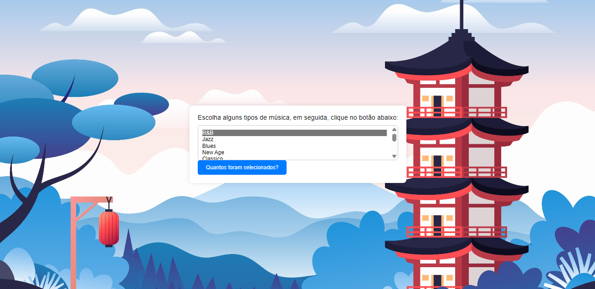

# Introdução 🎬✨
Mais um README aqui pessoal, dessa vez a atividade é sobre a utilização *FOR* utilizamos um código do site [Mdn Web docs](https://developer.mozilla.org/pt-BR/docs/Web/JavaScript/Guide/Loops_and_iteration) como base, depois teriamos que editar o HTML, adicionando mais 3 músicas escolhidas por nós mesmos, e por fim iriamos editar nosso CSS de maneira que ficasse agradavel a nós. Essa é uma declaração for que contará o número de opções selecionadas em uma lista (um elemento <select> permite várias seleções). Dentro do for é declarado uma váriavel i inicializada com zero. A declaração for verifica se i é menor que o número de opções no elemento <select>, executa sucessivas declaração if, e incrementa i de um em um a cada passagem pelo laço. Esse código consiste em contar os itens selecionados e apresenta a quantidade em uma caixinha de "Alert". 

# Pesquisa 🕵️‍♀️✨
*function howMany:*   
A função "howMany" tem a intenção de contar quantas vezes um determinado elemento ocorre em uma coleção de dados, como uma lista, um array ou uma string. Por exemplo, ela pode receber como argumentos o elemento a ser contado e a coleção de dados, e então retornar o número de ocorrências desse elemento na coleção. 

*selectObject:*       
A função "selectObject" provavelmente tem a intenção de selecionar ou filtrar objetos de uma coleção com base em determinados critérios.

*getElementById:*         
Ele é usado para selecionar um elemento HTML com base no valor do atributo id desse elemento.

*addEventListener:*      
Ele é utilizado para anexar um ouvinte de evento a um elemento HTML. Ele permite que você especifique uma função que será executada sempre que o evento especificado ocorrer no elemento.

# Interface 🛸✨

# Ferramentas utilizadas 🪛✨
* [Mdn Web docs](https://developer.mozilla.org/pt-BR/docs/Web/JavaScript/Guide/Loops_and_iteration)
* [Freepik](https://br.freepik.com/)
* Git Hub
* CSS
* HTML
* I.A
* JavaScript 

  
